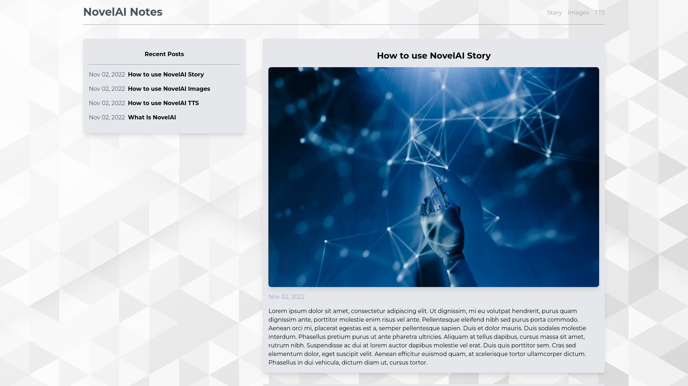
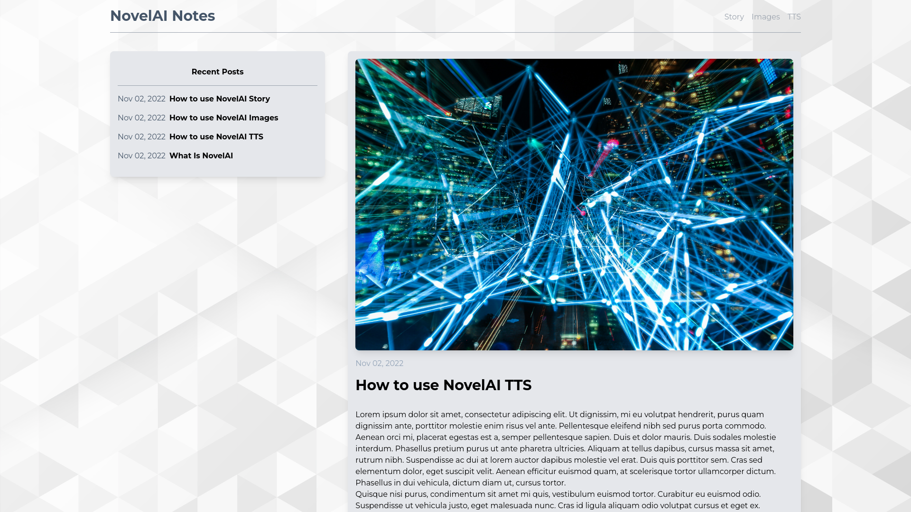
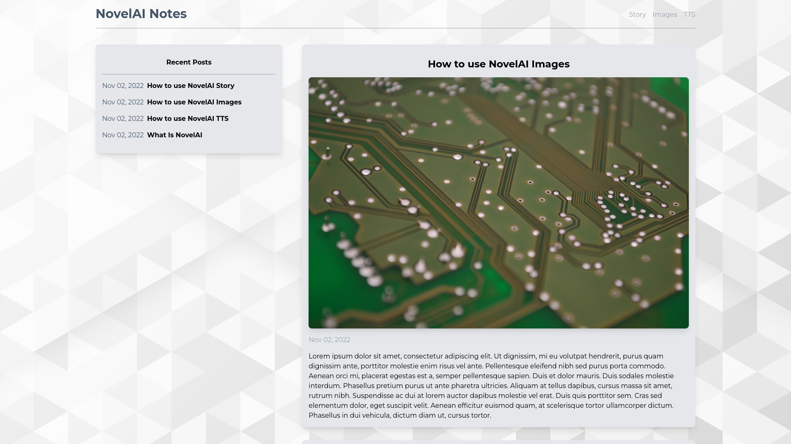
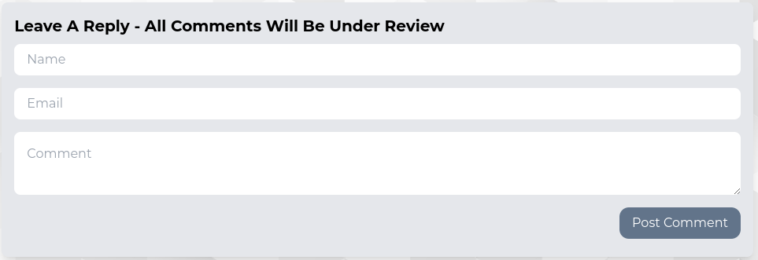
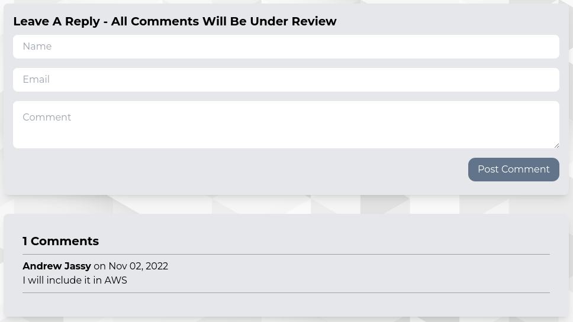
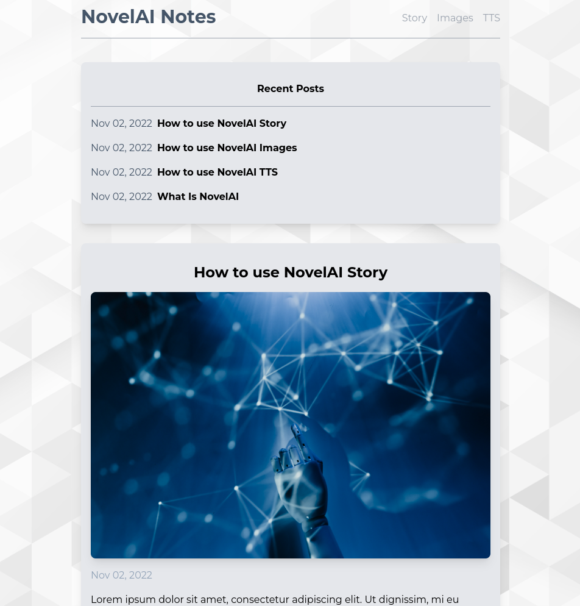

# NovelAI Note Blog

A blog discussing about NovelAI and StableDiffusion. Using NextJS react framework, GraphCMS/Hygraph for CMS, GraphQL for querying the CMS, and Tailwind CSS for CSS framework. Viewers can comment on posts and blog owner can vet comments that will be shown on the post.

# Dependencies

- "@graphcms/rich-text-react-renderer"
- "graphql"
- "graphql-request"
- "html-react-parser"
- "moment"
- "next"
- "react"
- "react-dom"
- "react-toastify"
- "sass"

# Screenshots

# Getting Started

1. Clone this repository onto your local device.
2. Install dependencies using the `npm install` command.
3. Create the `.env.local` by using `.env.local.example` as a reference: `cp .env.local.example .env.local`
4. Populate `.env.local` with the information needed
5. Run the server: `npm run dev`
6. Visit `http://localhost:3000/
